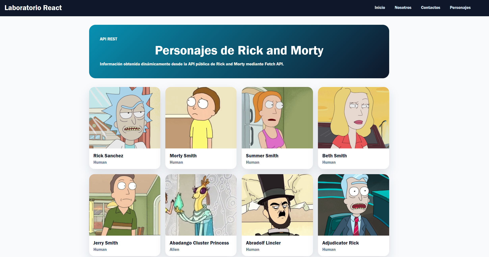

# Laboratorio React con Vite

Aplicación web desarrollada como práctica de laboratorio para la asignatura **Programación Integrativa de Componentes Web**. El proyecto aplica componentes reutilizables, rutas SPA, validación de propiedades, estilos encapsulados y consumo de una API REST externa.




## Descripción

Este proyecto implementa una aplicación frontend construida con **React** y **Vite**. La solución está organizada mediante una arquitectura modular basada en componentes, páginas y servicios, siguiendo buenas prácticas de desarrollo web moderno.

La aplicación permite navegar entre diferentes vistas sin recargar la página, reutilizar componentes visuales, validar props con PropTypes, aplicar CSS Modules para evitar conflictos de estilos y consumir información dinámica desde la API pública de Rick and Morty.

## Características

- Navegación SPA con `react-router-dom`.
- Componentes reutilizables con `props`.
- Validación de propiedades con `prop-types`.
- Estilos encapsulados mediante `CSS Modules`.
- Iconos visuales con `react-icons`.
- Consumo de API REST con `fetch`.
- Manejo de estado con `useState`.
- Carga inicial de datos con `useEffect`.
- Estructura organizada por `components`, `pages` y `services`.

## Vista previa

Para que el README se vea más profesional en GitHub, se recomienda agregar una captura de pantalla en esta ruta:

```txt
public/readme/preview.png
```

### Recomendación para la captura

La mejor captura para impresionar debe ser de la página **Personajes**, porque muestra:

- El diseño completo con `Header`, contenido y `Footer`.
- Las tarjetas dinámicas de personajes.
- Imágenes reales cargadas desde la API.
- Evidencia clara del consumo de datos externo.

También puedes agregar más capturas si deseas:

```txt
public/readme/inicio.png
public/readme/nosotros.png
public/readme/contactos.png
public/readme/personajes.png
```

Y luego mostrarlas así:

```md


```

## Tecnologías utilizadas

| Tecnología | Uso en el proyecto |
|---|---|
| React | Construcción de interfaces mediante componentes. |
| Vite | Entorno rápido de desarrollo y compilación. |
| React Router DOM | Navegación entre páginas de la SPA. |
| PropTypes | Validación de propiedades en componentes. |
| CSS Modules | Encapsulamiento de estilos por componente o página. |
| React Icons | Representación visual de asignaturas. |
| Fetch API | Consumo de datos desde una API externa. |

## Instalación

Clona el repositorio:

```bash
git clone URL_DEL_REPOSITORIO
```

Ingresa a la carpeta del proyecto:

```bash
cd practica-react
```

Instala las dependencias:

```bash
npm install
```

En Windows, si PowerShell bloquea `npm`, usa:

```bash
npm.cmd install
```

## Ejecución

Inicia el servidor de desarrollo:

```bash
npm run dev
```

En Windows:

```bash
npm.cmd run dev
```

Luego abre la URL que muestra Vite en la terminal, normalmente:

```txt
http://localhost:5173
```

## Scripts disponibles

| Comando | Descripción |
|---|---|
| `npm run dev` | Ejecuta el proyecto en modo desarrollo. |
| `npm run build` | Genera la versión optimizada para producción. |
| `npm run lint` | Revisa errores de calidad con ESLint. |
| `npm run preview` | Previsualiza la versión de producción. |

## Estructura del proyecto

```txt
src/
│
├── components/
│   ├── concepto-card/
│   ├── materia-item/
│   ├── personaje-card/
│   ├── header/
│   ├── footer/
│   ├── layout/
│   └── index.jsx
│
├── pages/
│   ├── inicio/
│   ├── Nosotros/
│   ├── contactos/
│   ├── personajes/
│   └── index.jsx
│
├── services/
│   └── rick-and-morty-service.js
│
├── App.jsx
├── main.jsx
├── App.css
└── index.css
```

## Páginas implementadas

### Inicio

Presenta información sobre React, componentes y hooks mediante el componente reutilizable `ConceptoCard`.

Ruta:

```txt
/
```

### Nosotros

Muestra asignaturas del semestre usando el componente `MateriaItem` e iconos importados desde `react-icons`.

Ruta:

```txt
/nosotros
```

### Contactos

Muestra información institucional y permite comprobar la navegación entre vistas.

Ruta:

```txt
/contactos
```

### Personajes

Consume la API pública de Rick and Morty y muestra personajes mediante el componente `PersonajeCard`.

Ruta:

```txt
/personajes
```

## Componentes principales

### `ConceptoCard`

Componente reutilizable que recibe:

- `imagen`
- `titulo`
- `descripcion`

Se utiliza para mostrar tarjetas informativas en la página Inicio.

### `MateriaItem`

Componente reutilizable que recibe:

- `icono`
- `nombre`
- `descripcion`

Se utiliza para representar asignaturas del semestre en la página Nosotros.

### `PersonajeCard`

Componente reutilizable que recibe:

- `imagen`
- `nombre`
- `especie`

Se utiliza para mostrar personajes obtenidos desde la API externa.

### `Header`

Contiene el título del proyecto y el menú de navegación principal.

### `Footer`

Muestra información institucional y el año actual generado dinámicamente con:

```js
new Date().getFullYear()
```

### `Layout`

Componente estructural que reutiliza `Header` y `Footer` en todas las páginas mediante la prop `children`.

## Servicio API

El consumo de datos externos se centraliza en:

```txt
src/services/rick-and-morty-service.js
```

La URL utilizada es:

```txt
https://rickandmortyapi.com/api/character
```

Función principal:

```js
export const obtenerPersonajes = async () => {
  const respuesta = await fetch(API_URL);

  if (!respuesta.ok) {
    throw new Error("No se pudo obtener la información de personajes");
  }

  const data = await respuesta.json();
  return data.results;
};
```

## Flujo de datos

1. El usuario entra a la ruta `/personajes`.
2. React renderiza `PersonajesPage`.
3. `useEffect` ejecuta la carga inicial de datos.
4. Se llama a la función `obtenerPersonajes`.
5. `fetch` consulta la API pública de Rick and Morty.
6. La respuesta se transforma a JSON.
7. Los personajes se guardan en el estado `personajes`.
8. Se recorre el arreglo con `map`.
9. Cada elemento se muestra mediante `PersonajeCard`.

## Validaciones realizadas

El proyecto fue validado con:

```bash
npm.cmd run lint
```

Resultado:

```txt
Sin errores de ESLint.
```

También fue compilado con:

```bash
npm.cmd run build
```

Resultado:

```txt
Build completado correctamente.
```

## Requisitos cumplidos del laboratorio

- Creación de proyecto React con Vite.
- Organización por carpetas.
- Implementación de componentes reutilizables.
- Uso de Props y PropTypes.
- Uso de Hooks.
- Aplicación de CSS Modules.
- Navegación con React Router.
- Consumo de API REST.
- Renderizado dinámico con `map`.
- Integración de páginas, componentes y servicios.

## Autor

Proyecto desarrollado para la asignatura **Programación Integrativa de Componentes Web**.


